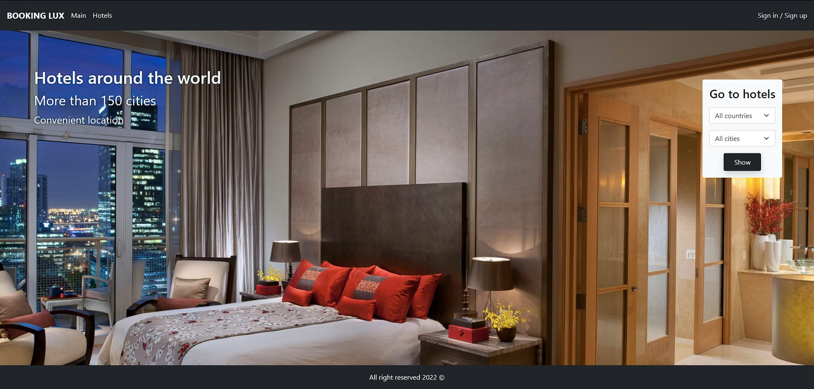
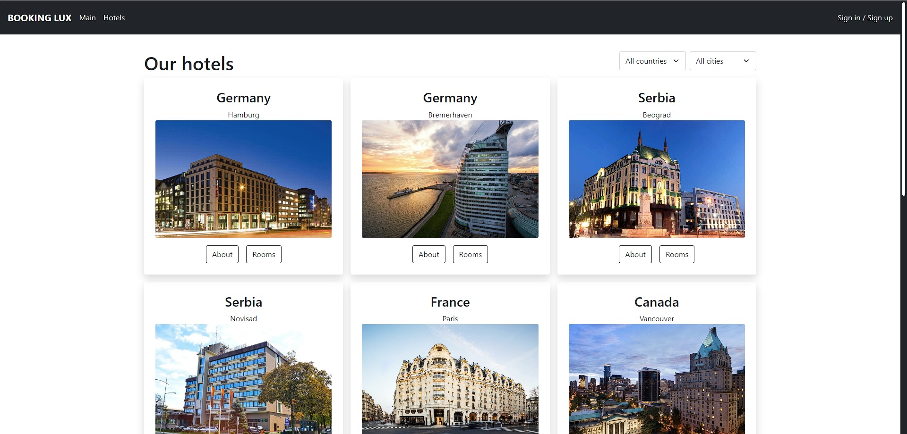
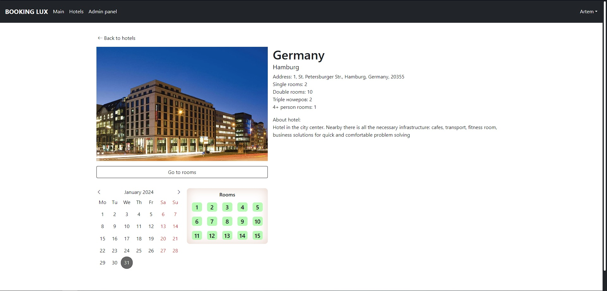
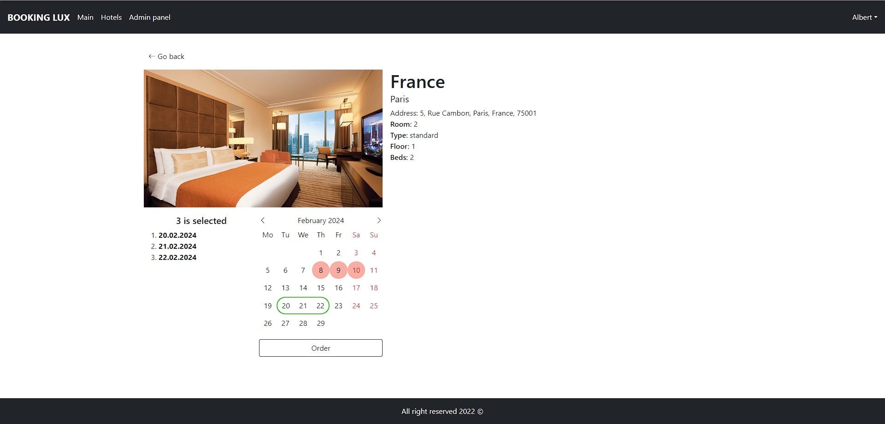
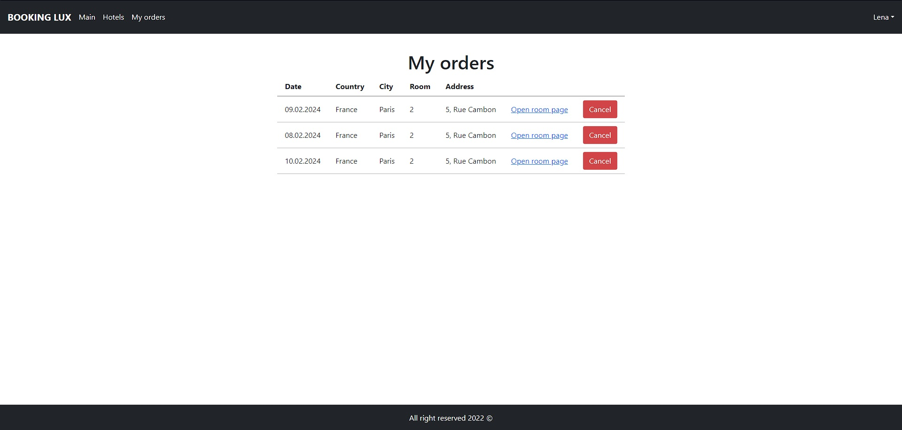
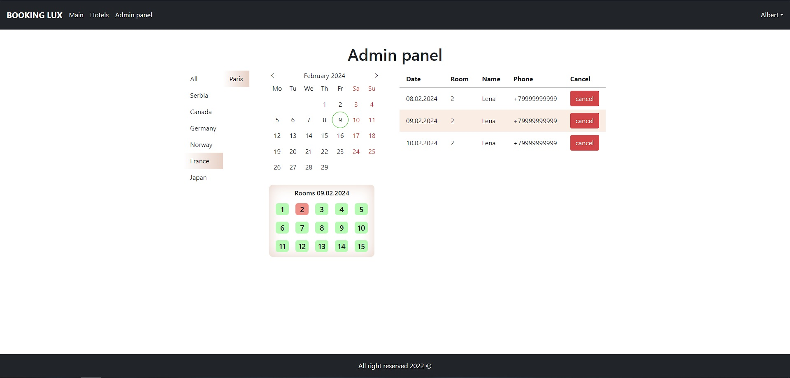

# Fullstack mini-app (server development practice)

Type: personal practice\
Stack: mern\
Description: Thesis for the courses in 2022. It is a service for bowling rooms of a hotel chain, with authorization.
Functional:
- Authorization and 2 types of roles - admin and user
- Search for hotels both from the main page and from the page with hotels and rooms
- Booking a room from your user
- Booking a room or cancellation from the admin panel in the name and phone number of the customer
- View all hotels and rooms and their status by date from the admin panel

Main page

Hotels list page

Hotel page

Room page

My orders page

Admin panel
